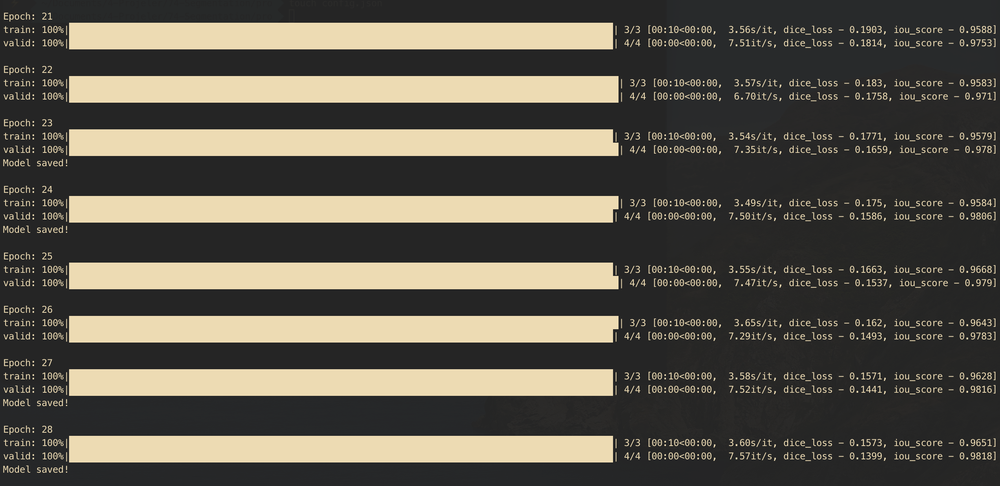
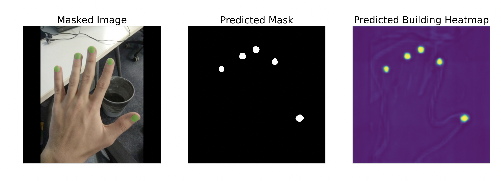
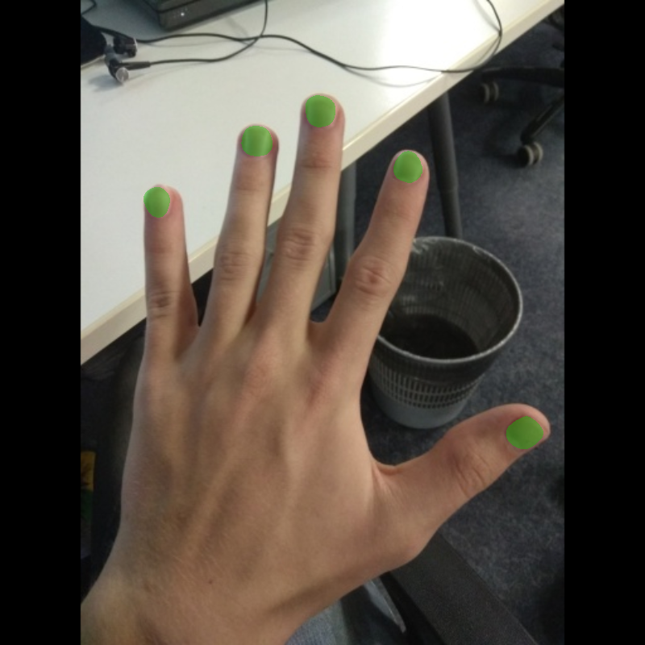

# NailsSegmentation

This project was made for nails segmentation using deep learning models. __DeepLabV3Plus__ was used for segmentation problem. ResNet101 were used as encoder and imagenet weights were used as encoder weights. The activation function was used as a sigmoid, since it was desired to solve a binary segmentation problem. The dataset has been downloaded from Kaggle (https://www.kaggle.com/datasets/vpapenko/nails-segmentation). This project is also an example of using pytorch gpu for m1 mac. For non-M1 mac, device part should be changed (mps-->gpu or mps-->cpu).
There are basic four steps here.  
* Data Preparation  
* Training
* Prediction  
* Evaluation  


First of all packages must be installed. The following command is used for this installation process:
*_(It is recommended to install and run via makefile)_* 
```
  make install
```
## Data Preparation


First of all, our raw data is uploaded under the dataset/raw folder. The dataset is divided as train, test, validation in this section. After that the following command should be used for image processing. 
```
  python3 image_converter.py
```

Thus, the processed data is generated under the dataset/processed folder. The size of the images is changed to 800x800 in image_converter.py. If this size is desired to be increased, this script can be changed. After these procedures, the training part starts.

## Training

Training, prediction and evaluation processes are managed by the main.py script. The parametere can be change in [config.json](/config.json). If there is a model (best_model.pth) that you have already trained in the model folder, training will be started using that model. For this reason, if you want to start the training from scratch, clear the model folder.  


For training:

```
  python3 main.py -m train -d mps
```
   

You can also use cpu or gpu instead of mps. The model is saved as model/best_model.pth after completing the training.

## Evaluation

The following command is used for evaluation  
```
  python3 main.py -m evaluate -d mps
```
__Evaluation on Test Data:  
Mean IoU Score: 0.9883  
Mean Dice Loss: 0.0728__    
  
  
Although the score seems to be high, all operations(training, evaluation) were completed with a small number of data. Therefore, in order to get good enough results in real life segmentation problems, it is necessary to use more data in training.

## Prediction


The command to be used for the prediction:  
```
  python3 main.py -m predict -i <image_path> -d mps
```
Original image:   
   
Prediction result:  
    
 
At the same time, the segmentated image is saved with the name dataset/result.png.  

result.png   
   


## Docker

The whole process can also be managed via docker. While using Docker, it is recommended to choose CPU as device.  
If you want to use this project via docker (default image name --> deeplabv3):
```
  make docker
```  

- Training:   

```
   make docker_run v=<project_folder_absolute_path> m=train d=cpu
```  
- Evaluation:   
```
   make docker_run v=<project_folder_absolute_path> m=evaluate d=cpu
``` 
- Prediction:  

```
   make docker_run v=<project_folder_absolute_path> m=predict d=cpu i=<img_path>
``` 

--------------------------------------------
